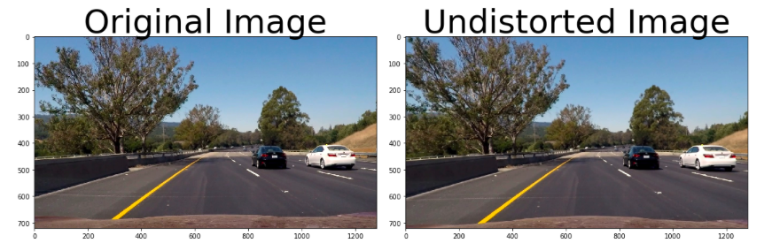
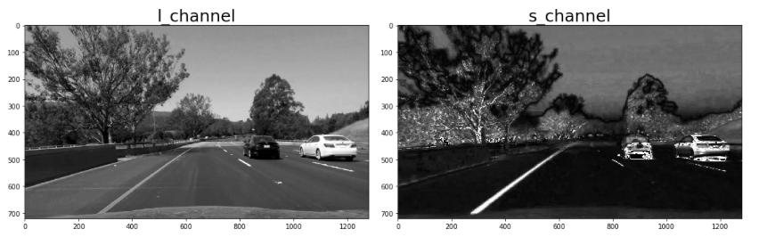

# Advanced-Lane-Line-Finding---Final-Project
The goals / steps of this project are the following:

* Compute the camera calibration matrix and distortion coefficients given a set of chessboard images.
* Apply a distortion correction to raw images.
* Use color transforms, gradients, etc., to create a thresholded binary image.
* Apply a perspective transform to rectify binary image ("birds-eye view").
* Detect lane pixels and fit to find the lane boundary.
* Determine the curvature of the lane and vehicle position with respect to center.
* Warp the detected lane boundaries back onto the original image.
* Output visual display of the lane boundaries and numerical estimation of lane curvature and vehicle position.
* Implement video processing pipeline

* Note: Make sure you use the correct grayscale conversion depending on how you've read in your images. Use cv2.COLOR_RGB2GRAY if you've read in an image using mpimg.imread(). Use cv2.COLOR_BGR2GRAY if you've read in an image using cv2.imread().'

# Rubric points
Here I will consider the Rubric points individually and describe how I addressed each point in my implementation

# Camera Calibration
**1. Briefly describe how you computed the camera matrix and distortion coefficients. Provide an example of a distortion corrected calibration image**

The code for this step is contained in the first two code cells in the iPython Jupyter codebook "Final_Project - Advanced Computer Vision.ipynb".

Using OpenCV functions "findChessboardCorners", "calibrateCamera" and "undistort", we achieve a good camera calibration and correection for distortion. Images of chessboards are provided, assuming different angles from a single camera point of view. We start by mapping "object points" using the function "findChessboardCorners", defined as the 3D real world coordinates of the corners in every image of the chessboards, then we will transform "object points" to 2D "image points" assuming z = 0. Both object points and image points are appended in two different arrays and then passed to the "calibrateCamera" function to compute the camera calibration and distortion coefficients, which are passed to the "undistort" function to apply the correction to the image with the following result: 

# Pipeline

**1. Provide an example of a distortion-corrected images**

The attached image below is an example of the result of the distortion correction image by applying the OpenCV function "undistort" to one of the test images provided in the course. 

The distortion correction can be noticed from the difference of the white vehicle baiased to the right and also by difference in the shape of the hood. 

**2.Describe how (and identify where in your code) you used color transforms, gradients or other methods to create a threshold binary image. Provide an example of a binary image result.**

To generate the binary image I started converting the undistorted image to HLS color space and separted the color channels to l_channel and s_channel. 

I've decided to use the combination of S and L channels because they do a fairly robust job of picking up the white and yellow lines under very different color and contrast conditions, while other combinations that I also explored looked messy. Ultimately I decided to do a combination of gradient threshold and color threshold to combine them and achieve the final binary image. 

![](Images/

